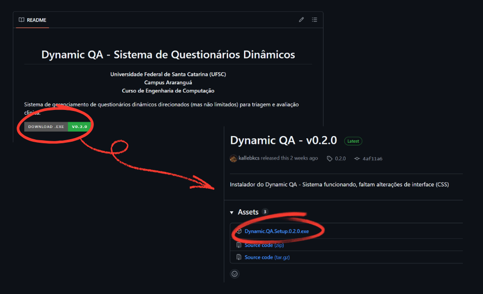
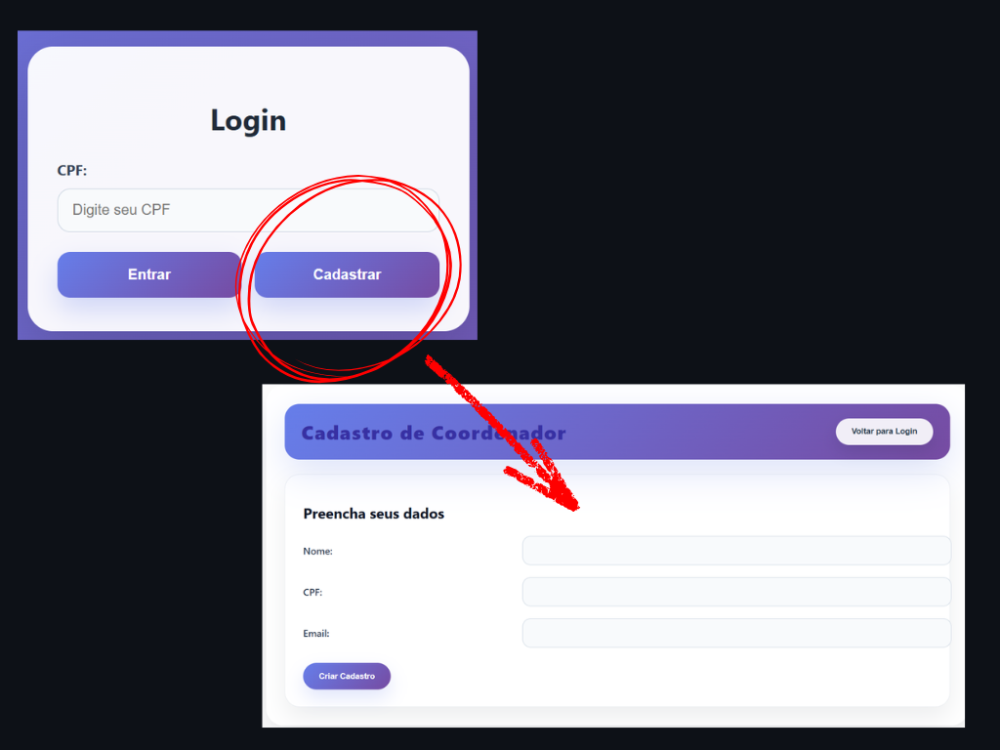

<div align="center">
  
# Dynamic QA - Sistema de Questionários Dinâmicos

**Universidade Federal de Santa Catarina (UFSC)**  
**Campus Araranguá**  
**Curso de Engenharia de Computação**

</div>

Sistema de gerenciamento de questionários dinâmicos direcionados (mas não limitados) para triagem e avaliação clinica.

[](https://github.com/kallebkcs/dynamic_qa/releases/latest)

## Informações do Projeto

| Item                       | Informação                                                  |
| -------------------------- | ------------------------------------------------------------|
| **Autores**                |  Settimio Yoghna Bidjjoque Da Costa e Kalleb da Costa Santos|
| **Orientação**             | Professor Jim Lau                                           |
| **Disciplina**             | Projeto de Sistemas Ubíquos e Embarcados                    |
| **Semestre**               | 2026.1                                                      |
| **Tipo**                   | Projeto Acadêmico                                           |
| **Tecnologias Principais** | Node.js, Express.js, Vue.js e SQLite                        |

---

## Visão Geral

Este projeto consiste em um Sistema de Questionários Dinâmicos para Avaliação de Sarcopenia, desenvolvido para auxiliar profissionais da saúde na criação, aplicação e gerenciamento de questionários clínicos.

A aplicação possui uma interface intuitiva e de fácil utilização, permitindo que coordenadores e monitores realizem avaliações de forma organizada e eficiente.

O sistema utiliza uma arquitetura baseada em Node.js, Express.js, Vue.js e SQLite, proporcionando uma aplicação leve, rápida e de fácil implantação.

O acesso ao sistema é realizado por meio de autenticação de usuários, sendo que:

O Coordenador realiza seu próprio cadastro e gerencia o sistema.
Os Monitores são cadastrados exclusivamente pelo coordenador e possuem acesso às funcionalidades relacionadas à aplicação dos questionários.

Além da aplicação dos questionários, o sistema gera automaticamente um diagnóstico com base nas respostas fornecidas e disponibiliza relatórios completos das avaliações realizadas.

---

## Objetivos

O sistema foi desenvolvido com os seguintes objetivos:

* Cadastro e gerenciamento de coordenadores;
* Cadastro de monitores realizado pelo coordenador;
* Criação e gerenciamento de questionários dinâmicos;
* Aplicação de questionários aos pacientes;
* Geração automática do resultado da avaliação (**Positivo** ou **Negativo**) com base nas respostas do questionário;
* Armazenamento do histórico das avaliações realizadas;
* Emissão de relatórios individuais das avaliações dos pacientes.

---

## Contexto Acadêmico

Este projeto foi desenvolvido como trabalho final da disciplina **Projeto de Sistemas Ubíquos e Embarcados**, do curso de **Engenharia de Computação**.

Seu principal objetivo é aplicar, de forma integrada, conhecimentos adquiridos ao longo do curso nas áreas de desenvolvimento de software, bancos de dados, interfaces web e sistemas computacionais, propondo uma solução tecnológica para apoiar o processo de avaliação de sarcopenia por meio da digitalização dos questionários e da automatização da geração de diagnósticos e relatórios.

---

## Tecnologias Utilizadas

Vue.js, Node.js, Express, SQLite, Electron.

---

# Estrutura do Projeto

```text
dynamic_qa/
│
├── backend/                  # API REST (Node.js + Express)
│   ├── controllers/          # Regras de negócio
│   ├── middleware/           # Autenticação e validações
│   ├── models/               # Modelos do banco
│   ├── routes/               # Rotas da API
│   ├── database/             # Configuração do SQLite
│   ├── services/             # Serviços da aplicação
│   └── server.js             # Inicialização da API
│
├── frontend/
│   ├── src/
│   │   ├── components/       # Componentes reutilizáveis
│   │   │   ├── AvisoToast.vue
│   │   │   ├── BlocoLogica.vue
│   │   │   ├── ConfirmModal.vue
│   │   │   ├── TipoEscolha.vue
│   │   │   ├── TipoEquacao.vue
│   │   │   └── TipoNumerico.vue
│   │   │
│   │   ├── views/            # Páginas da aplicação
│   │   │   ├── LoginView.vue
│   │   │   ├── CadastroView.vue
│   │   │   ├── HomeView.vue
│   │   │   ├── AdministradorView.vue
│   │   │   ├── CoordenadorView.vue
│   │   │   ├── MonitorView.vue
│   │   │   ├── CriacaoQuestionarioView.vue
│   │   │   ├── QuestionarioView.vue
│   │   │   └── VisualizarRespostasView.vue
│   │   │
│   │   ├── router/
│   │   │   └── index.js
│   │   │
│   │   ├── utils/
│   │   │   └── presetQuestions.js
│   │   │
│   │   ├── App.vue
│   │   └── main.js
│   │
│   ├── public/
│   ├── package.json
│   └── vite.config.js
│
├── README.md
└── package.json
```
---

# Arquitetura do Sistema

```text


                        Usuário
                           │
                           ▼
                   Interface Web (Vue.js)
                           │
                     Requisições HTTP
                           │
                           ▼
                   API REST (Express.js)
                           │
          ┌────────────────┴────────────────┐
          │                                 │
          ▼                                 ▼
  Autenticação                 Questionários / Usuários
          │                                 │
          └────────────────┬────────────────┘
                           ▼
                    SQLite Database
````
---

# Fluxo da Aplicação

``` text
Login/Cadastro
   │
   ▼
Autenticação
   │
   ▼
Dashboard
   │
   ├───────────────┐
   ▼               ▼
Coordenador     Monitor
   │               │
   ▼               ▼
Criar         Aplicar
Questionário  Questionário
   │               │
   └──────┬────────┘
          ▼
Salvar Respostas
          ▼
Gerar Diagnóstico
          ▼
Emitir Relatório
````
---
# Instruções de Uso

## Instalação

O primeiro passo é baixar o instalador do Dynamic QA. Para isso, vá para o topo deste documento, onde estará disponível uma opção de Download. Ela te levará para a última Release do programa. Basta baixar o arquivo `.exe`, executá-lo e seguir os passos para instalação.


## Primeiro acesso

No primeiro acesso ao Dynamic QA, você se deparará com uma tela de Login. Antes de começar a utilizar, deve-se efetuar o cadastro no botão "Cadastrar". Preencha as informações, salve e então faça o login com o CPF cadastrado. Esta é a forma de você se cadastrar como um **Coordenador**, um usuário que poderá criar, modificar e deletar questionários, além de cadastrar monitores, que terão acesso a executar apenas os questionários que você permitir.


## Funcionalidades do Programa
<h3 style="color: red">OBS: Esta é a tela inicial do programa para um Coordenador. Para o Monitor, se terá apenas a opção "INICIAR" e os questionários disponibilizados para ele.</h3>

Na tela inicial, se terão algumas opções:

1) Cadastrar um monitor, que acessará o programa pelo mesmo dispositivo, mas sem acesso às demais funcionalidades; ou um paciente, que o monitor poderá visualizar caso deseje.
3) Iniciar o questionário. Essa opção é escolhida para quando se estiver pronto para atender um paciente.
4) Abrir as demais opções para cada questionário.
5) Editar o questionário, o alterando. Ideal para correção de erros
6) Editar a cópia do questionário, mantendo o questionário antigo. Ideal para criação de uma variação de um questionário existente
7) Verificar as respostas do questionário em uma tabela.
8) Exportar o questionário, gerando um arquivo .json que poderá ser importado por outro usuário na opção "IMPORTAR QUESTIONÁRIO"
9) Excluir o questionário. Esta ação não pode ser desfeita.
10) Criar um questionário do zero.
11) Importar um questionário, através de um arquivo .json exportado por outro usuário.
---
## Criação de Questionário
Esta é a opção que exige maior atenção por parte do usuário. Cada questionário é composto por **blocos**, que correspondem às etapas do questionário, e cada bloco é composto por **perguntas**.
### Blocos
Podem ter três tipos:
#### Identificação
Apenas perguntas associadas à coletas de dados do paciente, como nome, idade, peso, altura, sexo, entre outras. É um bloco obrigatório, e as respostas dele influenciam perguntas com *contexto* e perguntas de tipo *Equação*.

Suas perguntas podem ser do tipo *Texto*, exclusivo para o bloco de identificação, *Escolha Única* ou *Numérico*. Os dois últimos funcionam de maneira simples em blocos de *Identificação*, diferente para blocos de outro tipo.
#### Comum
Perguntas deste bloco fazem com que o fluxo do questionário mude com base nas respostas recebidas.
#### Peso
Perguntas deste bloco tem pesos condicionados às respostas recebidas. Ao final de blocos deste tipo, se tem uma etapa de *Avaliação de Peso*, onde o fluxo do questionário é determinado baseado no peso acumulado pelas respostas do paciente. Esta etapa funciona exatamente como uma pergunta do tipo *Numérico* de um bloco de tipo *Comum*.

---

### Perguntas
Podem ter três tipos (desconsiderando o tipo *Texto*, exclusivo para *Identificação*):

#### Escolha Única
Perguntas deste tipo exigem que opções sejam fornecidas, e cada opção pode corresponder a um caminho (para blocos de tipo *Comum*) ou a um peso (para blocos de tipo *Peso*) diferente. Abaixo um exemplo para tipo *Peso*.


#### Numérico
Perguntas deste tipo são condicionadas com base no valor respondido. A condição possui 4 passos:
1) Condição numérica: Se o valor for *maior que*, *menor que* ou *igual a* o valor de limiar;
2) Limiar: O valor que é comparado com a resposta do usuário.
3) Decisão Lógica caso verdadeiro
4) Decisão Lógica caso falso
A *Decisão Lógica* depende do tipo do bloco: caso *Comum*, um caminho; caso *Peso*, um peso. Abaixo um exemplo para o tipo *Comum*.


#### Equação
Perguntas deste tipo devem ser constituídas de uma equação, com variáveis baseadas nas respostas de perguntas de identificação, e uma condicional numérica baseada no valor calculado da equação.
1) Equação: Escrita em *LaTeX*, uma ferramenta de escrita de documentos, que permite a escrita de equações. A maioria das equações necessárias para o contexto clínico não exigem de um conhecimento complexo desta ferramenta. Deixarei alguns exemplos que podem ser úteis para a escrita de equação na tabela abaixo. Para expressões mais complexas recomendo o uso do Google.
   
| Sintaxe | Renderização | Observação |
|---|---|---|
| `\Delta = b^2 - 4 a c` | $\Delta = b^2 - 4ac$ | Exemplo básico. Multiplicações podem ser representadas por espaços, asteriscos ou `\cdot`. |
| `\frac{a-1}{b}` | $\frac{a-1}{b}$ | Para escrever frações utiliza-se `\frac{}{}` ou simplesmente parênteses: `(a-1)/(b)`. |   
| `\sqrt{\pi r}` | $\sqrt{\pi r}$ | Para escrever raízes quadradas utiliza-se `\sqrt`. O programa entende o que `\pi` significa. |

2) Variáveis: Perguntas do tipo identificação podem ter seu valor resgatado para compor a equação. Basta que selecione o identificador e coincidir o símbolo com um símbolo utilizado na Equação.
3) Condicional de resultado: Se comporta como uma pergunta tipo *Numérico*.

Abaixo um exemplo de Equação:


#### OBS: Contexto
Perguntas *Numéricas* ou de *Equação* podem ter *contexto*. Isso é, serem condicionadas com base na resposta de uma pergunta de identificação. Marcar que uma pergunta tem contexto abrirá a opção para que escolha tal pergunta. Inserir contexto para uma pergunta fará com que o *Limiar* da condicional numérica se bifurque em relação à pergunta de identificação.

Por exemplo, se o contexto de uma pergunta é o sexo do paciente, então se terá um limiar para paciente masculino e outro para paciente feminino.

## Decisões Lógicas

Na raiz de perguntas de blocos de tipo diferente de *Identificação*, haverão decisões lógicas. Estas dependerão do tipo do bloco da pergunta.
- *Comum*: *redirecionamento* condicionado à resposta. Cada opção terá um *redirecionamento* em perguntas tipo *Escolha Única*, e se terá um *redirecionamento* para ambos verdadeiro e falso da condição de perguntas tipo *Numérico* e *Equação*.
- Peso: Peso condicionado à resposta. Se terá apenas um *redirecionamento* para perguntas de tipo peso, entretanto as possíveis respostas diferem entre si baseado no peso associado a elas.

---

### Redirecionamento
É a etapa mais importante de toda pergunta, e que define a lógica do questionário. É o final de qualquer pergunta, bloco ou questionário. É a etapa que possui o "Próxima Pergunta: ...". Essa etapa pode se ramificar baseado na seleção.
1) Próxima Pergunta: As opções são: Ir para uma pergunta existente, Criar nova pergunta e Fim de Bloco. A segunda cria uma pergunta na última posição *visual* do bloco, e muda para primeira opção com esta pergunta marcada. A primeira opção pode ser utilizada tanto ao criar uma pergunta manualmente (pelo botão, sem o uso da segunda opção) ou quando se deseja ir para uma pergunta já existente. A terceira opção abre a etapa abaixo:
2) Próximo Bloco: Análogo ao Próxima Pergunta, mas permite criar e redirecionar para outros blocos. A terceira opção aqui é a Fim de Questionário (Diagnóstico), a opção que finaliza o questionário caso seja alcançada.

Cada *redirecionamento* do questionário deve, idealmente, ser configurado de forma que não hajam perguntas inalcançáveis, que não hajam ciclos e que possam alcançar um Fim de Questionário.

Esta estrutura é quem define a ordem que o questionário será respondido. A posição visual não vale de nada aqui, visto que é possível retornar de perguntas avançadas para perguntas do início do questionário. Não se definiu uma interface que permita a organização visual das perguntas e blocos para lembrar o usuário exatamente disto: **a ordem das perguntas é estabelecida pelos redirecionamentos**.

---

### Vídeo no YouTube: Criando um Simulacro do Questionário de Sarcopenia

Neste vídeo (de 20 minutos, perdão por isso), procuro explicar em detalhes como se dá a criação de um questionário. Este vídeo está disponível [aqui](https://www.youtube.com/watch?v=goY6n0Hvywc).
